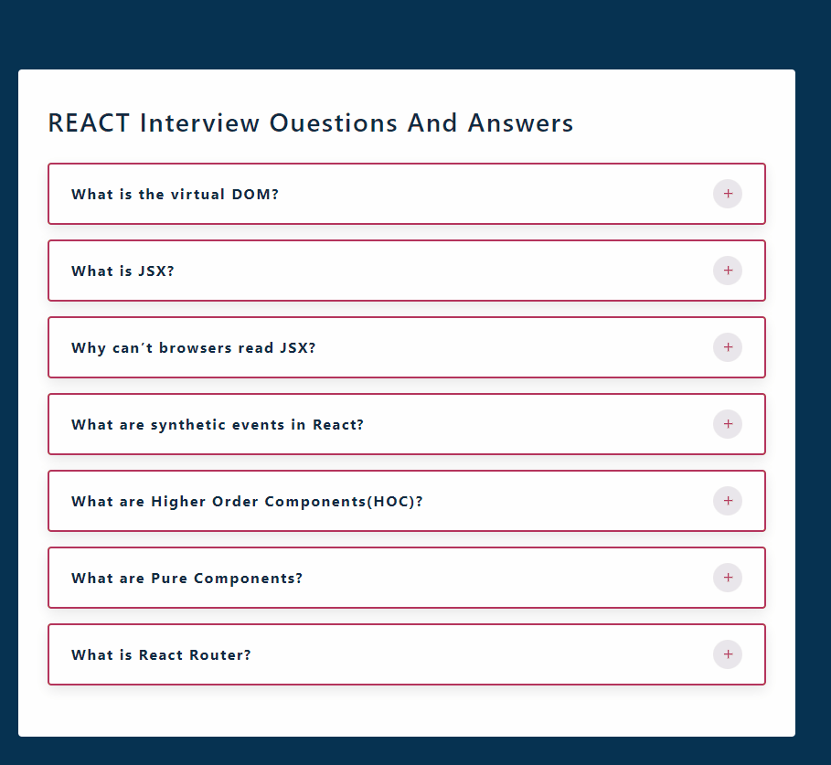

# İnterview Questions
This project is a website created using React and React-icons.

## Screenshots
 

[İnterview Questions Live Page](https://interview-questions-esma.netlify.app/)

## Tech/framework used
<b>Built with</b>  
 
## Description
In the project directory, you can run:
### `npm start`
Runs the app in the development mode.\
Open [http://localhost:3000](http://localhost:3000) to view it in your browser.

 
